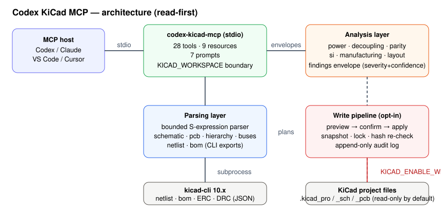

# Codex KiCad MCP

[](https://github.com/w23x0/codex-kicad-mcp/actions/workflows/validate.yml)
[](LICENSE)
[](mcp/pyproject.toml)
[](https://pypi.org/project/codex-kicad-mcp/)

A read-first [Model Context Protocol](https://modelcontextprotocol.io/) server
that lets Codex inspect KiCad projects, run review heuristics and ERC/DRC
checks through `kicad-cli`, and — only when explicitly enabled — perform
audited, snapshot-backed design edits.



## Why

Hardware engineers using Codex need a safe bridge between AI assistance and
KiCad. This server discovers projects, parses schematics and PCBs into
structured data, reviews them for power/decoupling/parity/SI/manufacturing
risks, and runs ERC/DRC without modifying design files. Writes require an
explicit opt-in flag and a preview/confirm cycle with snapshots and rollback.
KiCad remains the source of truth; the MCP provides assistive reporting.

## Quick start

Requirements: Python 3.10+, [`uv`](https://docs.astral.sh/uv/), KiCad 8+ with
`kicad-cli` on `PATH`, and a Codex build with stdio MCP support.

```powershell
cd mcp
uv venv
uv pip install -e ".[dev]"
$env:KICAD_WORKSPACE = "C:/path/to/your/eda-workspace"
uv run codex-kicad-mcp
```

Register the server in Codex (see
[`catalog/registration.example.toml`](catalog/registration.example.toml) for
Codex, Claude Desktop, VS Code, and Cursor blocks):

```toml
[mcp_servers.kicad]
command = "uv"
args = ["run", "--directory", "C:/path/to/Codex-KiCad/mcp", "codex-kicad-mcp"]
env = { KICAD_WORKSPACE = "C:/path/to/eda-workspace" }
```

Restart Codex, run `codex mcp list`, then ask it to list projects and inspect
a `.kicad_pro` file. The complete tool contract is in
[`docs/tool-reference.md`](docs/tool-reference.md). Answers to common setup
questions (workspace layout, which tools need KiCad, locale notes, enabling
writes) are in [`docs/faq.md`](docs/faq.md).

## Tools

28 registered tools in four groups — the full contract with schemas and
boundaries lives in the
[tool reference](docs/tool-reference.md#shared-review-envelope):

| Group | Tools | KiCad required |
| --- | --- | --- |
| Discovery | `list_kicad_projects`, `inspect_project`, `project_summary` | No |
| Read/parse | `read_schematic`, `read_pcb`, `read_hierarchy`, `read_buses`, `read_board_metrics`, `read_layer_stackup`, `read_zones`, `read_vias` | No |
| CLI exports & checks | `read_netlist`, `read_bom`, `run_kicad_cli_check`, `kicad_cli_version` | Yes |
| Review & writes | `analyze_power_rails`, `check_decoupling`, `cross_probe`, `compare_schematic_pcb`, `run_design_review`, `analyze_signal_integrity`, `analyze_board_density`, `check_fabrication_readiness`, plus 5 write-API tools | netlist reviews: Yes; SI/density: No |

All paths are resolved below `KICAD_WORKSPACE`. Attempts to escape fail before
any command starts. See
[`docs/security-model.md`](docs/security-model.md) for the full trust
boundaries.

## Repository layout

| Path | Content |
| --- | --- |
| [`mcp/`](mcp/) | Python MCP server source, tests, and skill |
| [`catalog/`](catalog/) | MCP and skill registry with schema and registration examples |
| [`docs/`](docs/) | Tool reference, quick start, FAQ, roadmap, compatibility, security model, and development workflow |
| [`scripts/`](scripts/) | Workspace and catalog validation |

## Development

```powershell
cd mcp
uv pip install -e ".[dev]"
uv run pytest -q            # fixture suite; skips real-project scans without KiCad
uv run pytest --cov         # with coverage
uv run ruff check src tests scripts
uv run mypy src
```

The real-project scan tests (`mcp/tests/test_real_projects.py`) copy KiCad's
installed demos into a temporary workspace and exercise the whole tool surface
with the actual `kicad-cli`; they skip cleanly when KiCad is absent. Run
workspace-level validation from the repository root:

```powershell
python scripts/validate_workspace.py
python scripts/validate_catalog.py
python scripts/check_links.py
```

See [`CONTRIBUTING.md`](CONTRIBUTING.md) and
[`docs/development-workflow.md`](docs/development-workflow.md) for the staged
delivery process, [`docs/roadmap.md`](docs/roadmap.md) for the version plan,
and [`docs/maintenance.md`](docs/maintenance.md) for the component log.

## License

[MIT](LICENSE)
